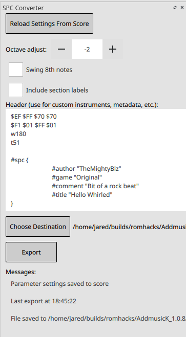

# SPC Converter for Musescore

  

SPC Converter is plugin for Musescore that can convert a score written in standard musical notation into a text format, which can then be processed by software like [AddMusicK](https://www.smwcentral.net/?p=section&a=details&id=24994) and inserted into a Super Mario World ROM for use in custom romhacks. Before attempting to write music using this plugin, you should be familiar with the basics of SMW music porting, for example as described [here](https://www.smwcentral.net/?p=viewthread&t=89606#0.2). It will run on any platform supported by MuseScore, although if you are on macOS or Linux, you will need to run AddMusicK via Wine or another compatibility layer.

### Dependencies
- MuseScore version 3.5 or greater (install from [MuseScore's website](https://musescore.org/en) or your package manager if you are on Linux)
- AddMusicK version 1.0.8 or greater (install from [SMW Central](https://www.smwcentral.net/?p=section&a=details&id=24994))

### Installation
Download `spcconverter.qml`, either from the command line with 

	git clone https://gitlab.com/jbitz/spcconverter.git 

or by downloading the file directly from GitLab (click on its name, then use the download button at the top right). Then, copy it into your MuseScore plugins directory (the default is `Documents/Musescore3/Plugins`). You then need to enable it by opening up MuseScore and clicking on `Plugins -> Plugin Manager`. From there, click the box next to the `spcconverter` plugin in order to enable it. You may have to click the "Reload Plugins" button for `spcconverter` to show up.

### Supported Features
- Any kind of key signature and accidental, including key signature changes in the middle of a piece
- Any kind of time signature, including time signature changes in the middle of a piece
- Any kind of clef, including 8va, 8vb, etc. and clef changes on a staff in the middle of a piece
- Tuplets of any kind and with any rhythm inside (triplets, quintuplets, etc.)
- Tied notes will be rendered properly as one sustained note without re-articulation
- Swung eighth notes can be turned on/off via a checkbox in the plugin's UI, so long as they do not occur on the same beat as a note of shorter duration (i.e. an eighth note followed by two sixteenth notes will cause issues, but two eighth notes followed by four sixteenth notes is perfectly fine.) The plugin is also smart enough to swing notes of larger values properly (i.e. a dotted quarter followed by an eighth). In time signatures that don't divide evenly into quarter notes (like 7/8), you may get some weird effects if you turn on swing.
- Insertion of AddMusicK commands (including hex codes)
- Editing of header data in the generated file to include metadata, custom instruments, ADSR, etc.
- Saving and reloading header data from a given score

### Example
Also included in this repository is a file `example.mscz`, which can be exported by this plugin to demonstrated some of its features. Note that this score only uses six of the eight available channels, although your own compositions can utilize up to eight staves without issue.

### Usage

Once the plugin has been installed and enabled as described in the previous section, you can invoke it by clicking on `Plugins -> SPC Converter` in the top menu of MuseScore. This will open up a panel from which you can convert your score and choose your options.

Due to the limitations of the SPC700 audio chip in the SNES, music targeting the platform has a maximum of eight channels, each of which corresponds to a staff in your score. These channels are all monophonic (one note at a time), meaning that chords/multiple voices written on the same staff will **NOT** be processed by the plugin. When preparing a score for export to AddMusicK, make sure that each staff has has a single voice line. The plugin will give you a warning message if this is not the case.

### Inserting Commands
AddMusicK is capable of processing certain commands, in addition to raw notes and rhythms. These commands affect the playback of the file, and can be used to change samples, adjust volume, create pitch bends, and more. To insert a command into your score, add a Staff Text element onto any note or rest (default shortcut: `Ctrl+T`). A staff text with a prefix of `-` will be inserted verbatim *before* the current note plays. A staff text with a prefix of `+` will be inserted *after*. For example, if you want to adjust the volume of a channel to 200 before it plays a given note, you would add the staff text `-v200` to that note. This syntax can also be used for hex commands, for example by adding the staff text `-$de $50 $10 $50` to enable vibrato on a given channel. A full list of available commands and hex codes can be found in AddMusicK's readme. It is also possible to add multiple pieces of staff text to the same note.

### Sample Changes
Because changing the current sample for a given channel occurs very commonly, you can omit the `+/-` prefix on the staff text and simply write in something like `@4`. This will automatically change the channel's sample *before* the given note is played - a prefix of `-` is added implicitly.

### Pitch Bends
This plugin handles pitch bends a little differently than other commands. If you are creating a simple pitch bend using the `&` command, then you could use it just like any other command (i.e. either a staff text with `+&` on the starting note of the pitch bend *or* a staff text with `-&` on the ending note). **For more complicated pitch bends using the `$dd` hex code, you must use the `-` prefix and place the command as staff text on the final note of the pitch bend.** Furthermore, omit the optional third argument which describes the destination note - the plugin will assume that the destination is the note on which the staff text has been placed. Using the `+` prefix along with the `$dd` hex code is not currently supported.

### Section Headers
Creating a staff text element beginning with the code `#SECTION` (for example `#SECTION Loop start`) will add a line break and a commented label to the resulting `*.txt` file at the corresponding location. Use this if you want to easily find and fiddle with a point in your generated program. A common use case would be for optimizing loops by hand as you finalize your song - you could mark the beginning and end of a looped section to easily find it in the output file. You can turn these section headers on and off using the check box in the UI.

### Currently Unsupported Features
- Grace notes - you must write them out literally in the score to achieve the same effect
- Multiple notes/voices per channel
- Any score elements not mentioned in the list of supported features above. For example, dynamic markings will not change the volume of a channel, and articulations like accents, stacattos, and slurs will not be rendered. You can of course add your own hex commands to achieve these effects (i.e. a legato command with `$f4` to simulate a slur)
- Song optimization - to achieve the smallest file size possible for your final song, it is best to take advantage of loops and repeating patterns (this is also a requirement for uploading it to SMW Central). As of now, this optimization must be done by hand - it is best to work with unoptimized files exported by the plugin until you are happy with your work, then clean it up by hand as a final step. You can use the `#SECTION` command (see the "Section Headers" section above) to make this task easier for yourself.

